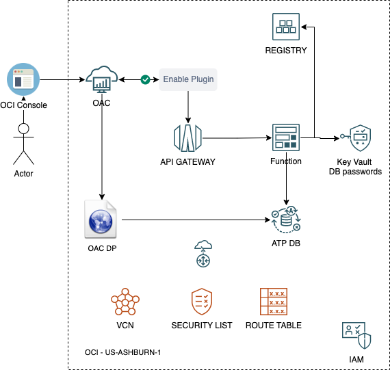

# social-media-sentiment-analysis
Cloud system that enables the power of Oracle Cloud Infrastructure to fetch data from Twitter and visualize the results on OAC instance.



## IMPORTNAT THINGS TO KEEP IN MIND

FN COMMON COMMANDS
```
fn invoke <functions-app-name> <functions-name>
fn deploy --verbose --app <functions-app-name>
```

DYNAMIC GROUP FOR API GATEWAY
```
ALL {resource.type = 'ApiGateway', resource.compartment.id = '<compartment-ocid>'}	
ALL {resource.type= 'fnfunc', resource.compartment.id= '<compartment-ocid>'}
```

POLICIES
```
Allow dynamic-group <dynamic-group-name> to use secret-family in compartment <compartment-name>
ALLOW any-user to use functions-family in compartment <compartment-name> where ALL {request.principal.type= 'ApiGateway', request.resource.compartment.id = '<compartment-ocid>'}
Allow dynamic-group <dynamic-group-name> to use functions-family in compartment <compartment-name>
```

Useful Links:
1. https://developer.oracle.com/tutorials/call-a-function-api-oci-clouddey/
2. https://blogs.oracle.com/cloud-infrastructure/post/the-power-of-oracle-functions-using-python-connecting-to-an-autonomous-transacting-processing-database-with-a-wallet-stored-as-secrets 
